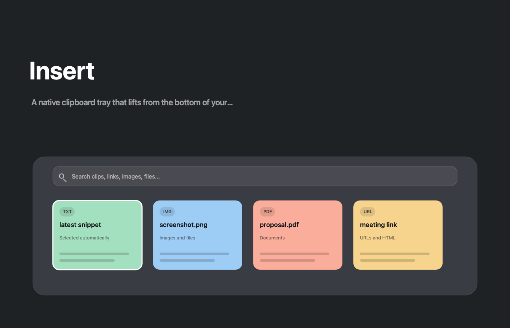
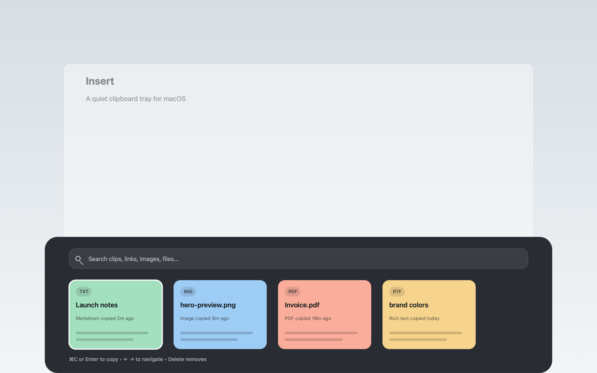

# Insert



**Insert** is a minimal native clipboard tray for macOS. It stays out of the way until your shortcut is pressed, then lifts from the bottom of the screen with your recent clipboard items ready to search, select, copy, or delete.

The app is intentionally small: no account, no cloud sync, no oversized window. Just a fast tray, cards, search, keyboard navigation, persistent history, and a few practical settings.

## Highlights

- Bottom-of-screen clipboard tray inspired by Paste.
- Recent item is selected automatically when the tray opens.
- Search across saved clipboard history.
- Navigate cards with the arrow keys.
- Press `Enter` or `Command+C` to copy the selected item.
- Press `Backspace` or `Delete` to remove the selected item.
- Customizable global shortcut.
- Optional Dock icon hiding.
- Optional launch at login.
- Persistent clipboard history across restarts.
- Supports common pasteboard payloads: text, URLs, files, images, PDFs, rich text, HTML, colors, and typical media UTIs.



## Download

Download the latest drag-to-install disk image from [GitHub Releases](https://github.com/KenWuqianghao/Insert/releases/latest) and open `Insert-Installer.dmg`. Drag **Insert** into **Applications**.

Local builds are written to:

```sh
build/Insert-Installer.dmg
```

## Gatekeeper Note

`make dmg` now ad-hoc signs the app bundle, clears local extended attributes, and verifies the disk image. That fixes common local packaging issues that make macOS report an app as broken.

For public downloads, macOS still expects a Developer ID certificate and Apple notarization. Without that Apple-issued certificate, a DMG downloaded from the internet can still trigger Gatekeeper warnings on other machines. Build a local signed DMG with:

```sh
make dmg
```

If you have a Developer ID Application certificate installed, pass it explicitly:

```sh
make dmg SIGN_IDENTITY="Developer ID Application: Your Name (TEAMID)"
```

## Controls

| Action | Shortcut |
| --- | --- |
| Open Insert | Custom global shortcut, default `Command+Shift+V` |
| Move selection | Arrow keys |
| Copy selected item | `Enter` or `Command+C` |
| Delete selected item | `Backspace` or `Delete` |
| Search | Type in the tray search field |

Use the keyboard button or settings menu in the tray to record a new global shortcut. Use the settings menu to toggle Dock visibility and launch at login.

## Build From Source

```sh
make run
```

The app bundle is created at `build/Insert.app`.

To generate the marketing screenshots used in this README:

```sh
make marketing-assets
```

To build the installer:

```sh
make dmg
```

## Windows

Windows work lives under [`windows/Insert.Windows.sln`](./windows/Insert.Windows.sln) and [`windows/Insert.Windows`](./windows/Insert.Windows). It is a native WinForms port with the same clipboard tray, search, hotkey, and persistent history model.

Build it on Windows with the .NET 8 Windows Desktop workload installed:

```sh
dotnet build windows/Insert.Windows.sln
```

## Storage

Text clipboard history is saved locally at:

```sh
~/Library/Application Support/Insert/ClipboardHistory.json
```

Windows startup is stored in the current user's `Run` registry key and is toggled from the tray menu.
