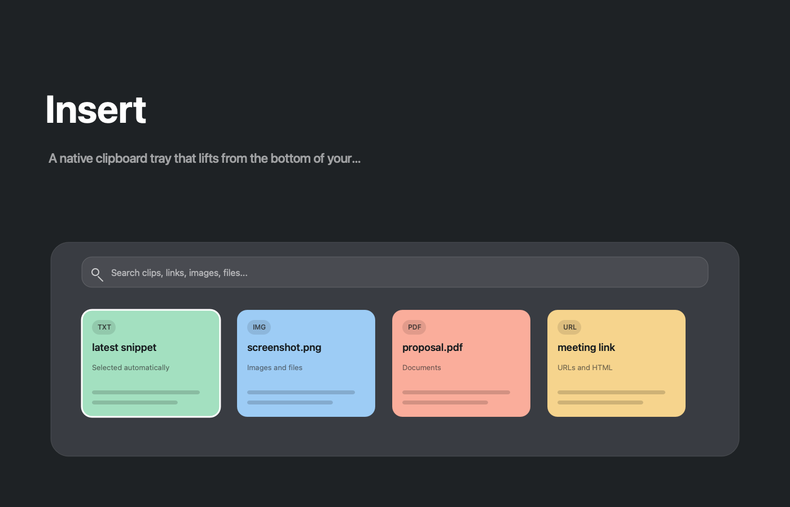
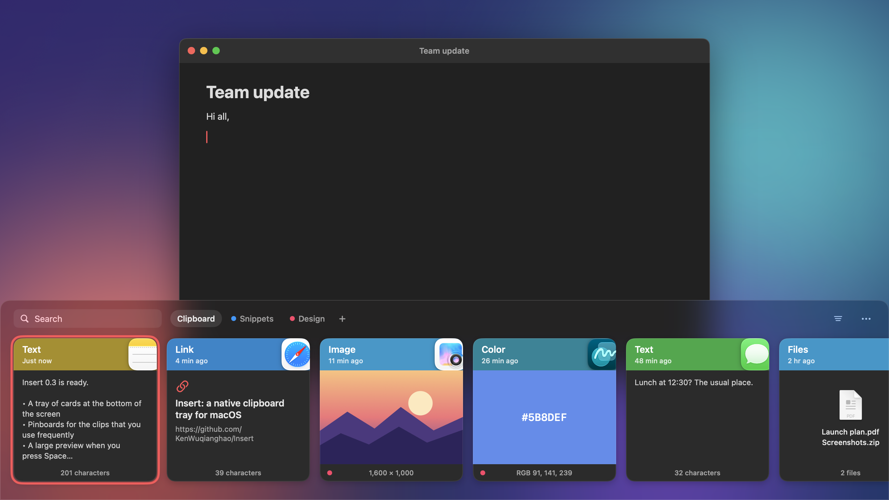

# Insert



**Insert** is a native clipboard tray for macOS. Press the shortcut and the tray comes up from the bottom of the screen. Select a clip and Insert pastes it into the app that you use.

Product page: https://insert-app.vercel.app

Insert has no account and no cloud sync. All data stays on your Mac.

## Highlights

- A full-width tray at the bottom of the screen, inspired by Paste.
- Cards show the source app, the type, the time, and a preview of the content.
- Press `Enter` to paste the selected clip into the active app.
- Press `Shift+Enter` to paste the clip as plain text.
- Type to search. Use the filter to show one type of clip.
- Pinboards keep clips that you use frequently. The history limit does not delete pinned clips.
- Press `Space` to see a large preview of a clip.
- Hold `Command` to show the numbers 1 to 9 on the cards. Press `Command+1` to `Command+9` to paste that card.
- Insert skips items that an app marks as concealed or transient, for example passwords from a password manager.
- You can pause capture, and you can ignore the apps that you select.
- The Settings window has the global shortcut, the Dock icon, launch at login, direct paste, and the history limit.
- Insert stores text, links, files, images, PDFs, rich text, colors, and common media types.



## Download

Download the latest drag-to-install disk image from [GitHub Releases](https://github.com/KenWuqianghao/Insert/releases/latest) and open `Insert-Installer.dmg`. Drag **Insert** into **Applications**.

Local builds are written to:

```sh
build/Insert-Installer.dmg
```

## Gatekeeper Note

`make dmg` now ad-hoc signs the app bundle, clears local extended attributes, and verifies the disk image. That fixes common local packaging issues that make macOS report an app as broken.

For public downloads, macOS still expects a Developer ID certificate and Apple notarization. Without that Apple-issued certificate, a DMG downloaded from the internet can still trigger Gatekeeper warnings on other machines. Build a local signed DMG with:

```sh
make dmg
```

If you have a Developer ID Application certificate installed, pass it explicitly:

```sh
make dmg SIGN_IDENTITY="Developer ID Application: Your Name (TEAMID)"
```

## Controls

| Action | Shortcut |
| --- | --- |
| Open or close Insert | Global shortcut, default `Command+Shift+V` |
| Move the selection | Arrow keys |
| Extend the selection | `Shift` + arrow keys |
| Select all clips | `Command+A` |
| Paste the selected clip | `Enter` or double-click |
| Paste as plain text | `Shift+Enter` |
| Copy without paste | `Command+C` |
| Paste card 1 to 9 | `Command+1` to `Command+9` |
| Preview | `Space` (when the search field is empty) |
| Delete the selection | `Backspace` or `Delete` (when the search field is empty), or `Command+Backspace` |
| Go to the next or previous pinboard | `Tab` / `Shift+Tab`, or `Command+]` / `Command+[` |
| Search | Type in the tray |
| Close the preview, clear the search, or close the tray | `Esc` |
| Open Settings | `Command+,` |

Right-click a card to pin, rename, preview, or delete the clip. Right-click a pinboard tab to rename it, change its color, or delete it.

## Accessibility Permission

Insert pastes with a simulated `Command+V`. macOS permits this only for apps that have the Accessibility permission.

1. Open Insert. If the permission is missing, the tray shows a notice.
2. Click **Allow…** in the notice.
3. Turn on **Insert** in System Settings > Privacy & Security > Accessibility.

Without the permission, Insert copies the clip and you press `Command+V`. To use copy only, turn off **Paste directly into the active app** in Settings.

A local build has an ad hoc signature. macOS can ask for the permission again after each new build.

## Build From Source

```sh
make run
```

The app bundle is created at `build/Insert.app`.

To build a second copy with its own bundle id, storage folder, and settings:

```sh
make dev
```

This creates `build/InsertDev.app`. Use it to test a build while an installed Insert runs.

To generate the marketing screenshots used in this README:

```sh
make marketing-assets
```

To build the installer:

```sh
make dmg
```

## Windows

The Windows-specific repo is available at:

https://github.com/KenWuqianghao/insert-windows

The mirrored source under [`windows/Insert.Windows.sln`](./windows/Insert.Windows.sln) and [`windows/Insert.Windows`](./windows/Insert.Windows) is a native WinForms port with the same clipboard tray, search, hotkey, and persistent history model.

Build it on Windows with the .NET 8 Windows Desktop workload installed:

```sh
dotnet build windows/Insert.Windows.sln
```

## Storage

Insert keeps its data in a folder that has the name of the bundle id:

```sh
~/Library/Application Support/com.local.Insert/
├── index.json        # clip metadata and pinboards
├── payloads/         # one file for each clip, with the full pasteboard content
└── thumbnails/       # one PNG for each image clip
```

Insert does not store an item that is larger than 50 MB.

Version 0.2 does not read the history from version 0.1. The old file `~/Library/Application Support/Insert/ClipboardHistory.json` stays on disk. Delete it if you do not need it.

Windows startup is stored in the current user's `Run` registry key and is toggled from the tray menu.
